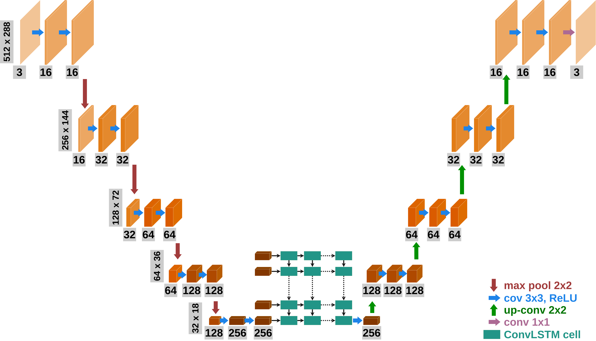
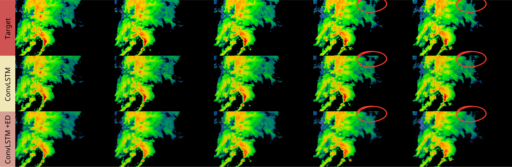
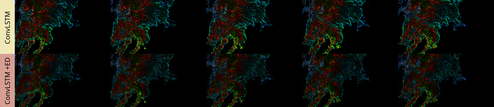
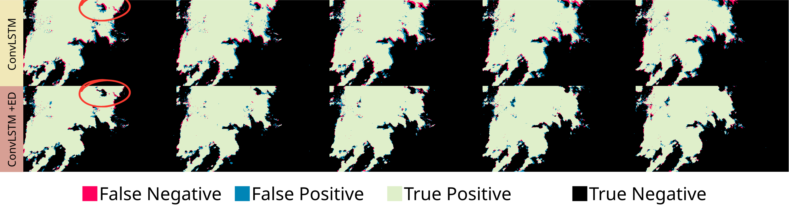

# ConvLSTM-Cloud-Prediction

## Table of Contents

1. [About](#about)
2. [Features](#features)
3. [Data](#data)
4. [Models](#models)
5. [Post-Thesis Improvements](#post-thesis-improvements)
6. [Installation](#installation)
7. [License](#license)
8. [Sources](#sources)

## About

ConvLSTM-Cloud-Prediction is a project aimed at predicting cloud movements using Convolutional Long Short-Term Memory (ConvLSTM) networks. It was developed as part of a bachelor's thesis focusing on cloud forecasting from radar data using neural networks.

## Features

- Utilizes ConvLSTM architecture for cloud movement prediction.
- Training and evaluation conducted using PyTorch.
- Pretrained models available in the `Models` directory.
- Output files in MP4 format located in the `Output_files` directory.
- Commented codes provided in `src`.
- Bachelor thesis titled "Cloud Forecasting from Radar Data Using Neural Networks" is available in PDF format as `thesis.pdf`.
- Hardware used for training: 
  - Processor: AMD EPYC 7543P
  - RAM: 512 GB
  - GPUs: 2x NVIDIA A100 with 40 GB memory

## Data

The data used for training and evaluation was provided by the Slovak Hydrometeorological Institute (SHMÚ). The dataset includes radar images capturing cloud movements over time.

[SHMÚ](https://www.shmu.sk/sk/?page=1)

## Models

The project employs two types of models:

1. **ConvLSTM**: Uses Convolutional LSTM layers to predict sequences.
2. **ConvLSTM with Encoder-Decoder**: Adds an encoder-decoder architecture to reduce the input size before entering the ConvLSTM part. This lets us use more ConvLSTM layers without running into memory issues.

## Post-Thesis Improvements

Post-thesis improvements include reducing the number of ConvLSTM layers from 8 to 5, which resulted in significantly better quality of output images. Images showing these improved results is included below.

The rest of the output files in MP4 format are located in the `Output_files` folder. The pretrained model is available in the `Models` directory.

## Installation

To install the project, follow these steps:

1. Clone the repository.
2. Navigate to the project directory.
3. Install dependencies using `pip install -r requirements.txt`.

## License

This project is licensed under the [MIT License](LICENSE).

## Sources

The architecture source code was inspired by [Video Frame Prediction using ConvLSTM Network in PyTorch](https://sladewinter.medium.com/video-frame-prediction-using-convlstm-network-in-pytorch-b5210a6ce582).
